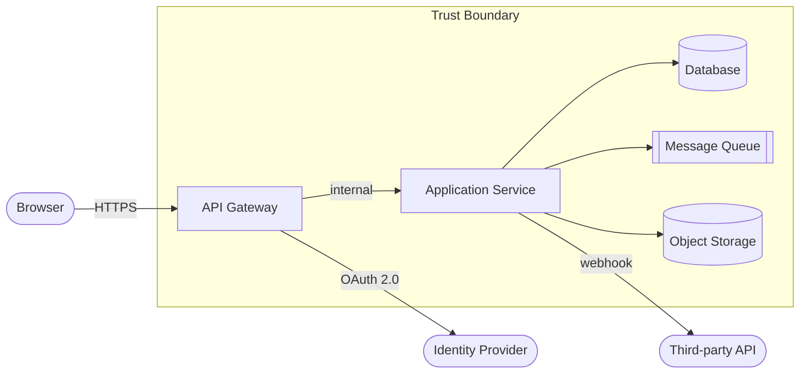
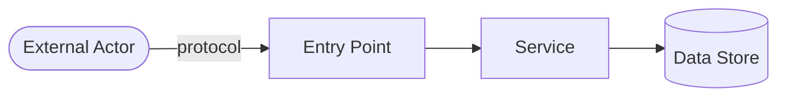

# Threat Modeling — STRIDE Process

Apply this process during the Architecture stage, before implementation begins.

---

## What is Threat Modeling?

Threat modeling is a structured approach to identifying security threats to a system **before** they are exploited. The goal is to find design-level vulnerabilities that code-level security controls cannot fix.

**Answer these four questions:**
1. What are we building?
2. What can go wrong?
3. What are we going to do about it?
4. Did we do a good enough job?

---

## STRIDE Threat Categories

| Letter | Threat | Violated Property | Example |
|--------|--------|------------------|---------|
| **S** | Spoofing | Authentication | Attacker impersonates a legitimate user |
| **T** | Tampering | Integrity | Attacker modifies data in transit or at rest |
| **R** | Repudiation | Non-repudiation | User denies performing an action; no audit trail |
| **I** | Information Disclosure | Confidentiality | Sensitive data exposed in error messages or logs |
| **D** | Denial of Service | Availability | System made unavailable by resource exhaustion |
| **E** | Elevation of Privilege | Authorization | Attacker gains permissions beyond their role |

---

## Threat Modeling Process

### Step 1 — Create a Data Flow Diagram (DFD)

Draw every:
- **External entity** (users, external services, third-party APIs)
- **Process** (your application components, services, functions)
- **Data store** (database, cache, file storage, queue)
- **Data flow** (HTTP requests, async messages, function calls)
- **Trust boundary** (the line between zones of different trust levels)



Identify and mark every trust boundary crossing — that's where the most interesting threats live.

### Step 2 — Enumerate Threats by STRIDE

For each data flow and component, systematically ask STRIDE questions:

#### Spoofing Threats (Authentication)
- Can an attacker claim to be a different user?
- Can a service claim to be a different service?
- Can an attacker replay a captured authentication token?
- Is there no authentication at all on a component?

**Mitigations:** Strong authentication (MFA, SSO, mutual TLS), token expiry, signature validation

#### Tampering Threats (Integrity)
- Can an attacker modify data in transit?
- Can an attacker modify data at rest?
- Can an attacker modify inputs to change processing outcome?

**Mitigations:** TLS for transit, message signing, input validation, HMAC on stored data, database integrity constraints

#### Repudiation Threats (Non-repudiation)
- Can a user deny having performed an action?
- Are there audit logs for all sensitive operations?
- Can an attacker delete or modify audit logs?

**Mitigations:** Immutable audit logging, digital signatures, log shipping to append-only store

#### Information Disclosure Threats (Confidentiality)
- Can an attacker read other users' data?
- Can sensitive data be extracted from error messages?
- Can data be inferred from timing or side-channel attacks?
- Is PII in logs?

**Mitigations:** Encryption (transit + rest), authorization checks, safe error messages, data classification

#### Denial of Service Threats (Availability)
- Can an attacker exhaust resources (CPU, memory, disk, connections)?
- Can an attacker lock out legitimate users?
- Can an attacker fill a queue or database?

**Mitigations:** Rate limiting, input size limits, resource quotas, circuit breakers, autoscaling

#### Elevation of Privilege Threats (Authorization)
- Can a lower-privileged user access higher-privileged features?
- Can a user manipulate their own data to gain permissions?
- Can a service account be exploited to gain cloud admin access?
- Is there a path to privilege escalation through role assignment?

**Mitigations:** Server-side authorization, separation of duties, least-privilege IAM, audit of privilege operations

### Step 3 — Rate Each Threat

Use DREAD or a simple 3-tier severity rating:

**Severity Levels:**

| Level | Criteria | Response |
|-------|----------|---------|
| **Critical** | Immediate full system compromise or data breach | Block release; fix before implementation |
| **High** | Significant security impact; exploitable in common conditions | Must fix before release |
| **Medium** | Limited impact or difficult to exploit | Fix in current sprint |
| **Low** | Minor exposure; defense in depth | Fix in backlog |
| **Info** | No direct impact; observation or best practice | Document; address when convenient |

### Step 4 — Define Mitigations

For each threat rated Medium or above, define:
- The specific **control** that mitigates it
- Where in the system the control is implemented
- Who is responsible for implementing it
- How to test that the control works

### Step 5 — Validate Mitigations

For each mitigation:
- Is there a test that proves the mitigation is in place?
- Does the CI pipeline include a check for this control?
- Is there a monitoring alert if the control is bypassed?

---

## Threat Model Document Template

```markdown
# Threat Model: [System / Feature Name]
**Date:** YYYY-MM-DD  
**Version:** 1.0  
**Modeler:** [Name/Agent]

## Scope
[What is being modeled — system boundaries, included/excluded components]

## Assets to Protect
| Asset | Classification | Owner |
|-------|---------------|-------|
| User PII | Restricted | [Team] |
| Auth Tokens | Restricted | [Team] |
| Business data | Confidential | [Team] |

## Trust Boundaries
[List each trust boundary and what crosses it]

## Data Flow Diagram



## Threats & Mitigations

### THREAT-001: [Short title]
- **Category:** STRIDE category
- **Description:** [What could an attacker do?]
- **Attack vector:** [How would it be exploited?]
- **Severity:** Critical / High / Medium / Low
- **Mitigation:** [Specific control]
- **Implementation location:** [Where in the system]
- **Test:** [How to verify mitigation is effective]
- **Status:** Open / Mitigated / Accepted (with justification)

## Residual Risks
[Any threats marked Accepted — must include business justification and sign-off]

## Review Sign-off
- [ ] Architecture review complete
- [ ] Security engineer approved
- [ ] Product owner acknowledged residual risks
```

---

## Threat Modeling Checklists by System Type

### Web Application
- [ ] CSRF protection on all state-changing operations
- [ ] XSS protection in all template rendering
- [ ] SQL injection prevention
- [ ] Insecure Direct Object Reference (IDOR) protection on every resource endpoint
- [ ] Open redirect protection on login/logout redirects
- [ ] Clickjacking protection (X-Frame-Options or CSP frame-ancestors)
- [ ] Subdomain takeover prevention

### REST API
- [ ] Authentication on every non-public endpoint
- [ ] Authorization at resource level (not just route level)
- [ ] Rate limiting per client/IP
- [ ] Input schema validation
- [ ] Mass assignment protection (never bind request body directly to entity)
- [ ] Sensitive data not in URL path or query parameters (use body or headers)

### Microservices / Service Mesh
- [ ] Service-to-service authentication (mTLS or service identity token)
- [ ] Network policies restrict which services can communicate
- [ ] Each service has its own identity and credentials
- [ ] No service can impersonate another service

### Data Pipeline / ETL
- [ ] Input validation at data ingestion point
- [ ] PII handled per retention and access policy
- [ ] Audit log of what data was processed and when
- [ ] Failed records do not expose raw PII in error logs
- [ ] No secrets in pipeline configuration

### Mobile Application
- [ ] Certificate pinning (or HPKP + monitoring)
- [ ] No sensitive data in local storage or SQLite without encryption
- [ ] No sensitive data in logs accessible to other apps
- [ ] Jailbreak/root detection for high-security features
- [ ] API authentication uses short-lived tokens (not long-lived API keys)
