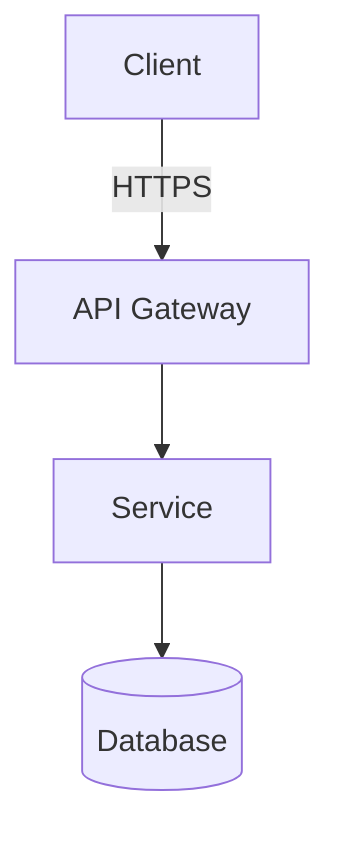

# Documentation Standards

Documentation is a first-class deliverable. Code without documentation is incomplete code.

---

## Required Documentation by Artifact Type

### Source Code

| Element | Requirement | Format |
|---------|-------------|--------|
| Public function/method | Required | JSDoc / docstring / Javadoc / XML doc / GoDoc |
| Public class/interface | Required | Doc comment explaining purpose and usage |
| Complex algorithm | Required | Inline comment explaining approach and why |
| Non-obvious business rule | Required | Inline comment referencing the requirement/rule |
| Configuration option | Required | Doc comment with type, valid values, default, required/optional |

### Projects and Repositories

Every repository must have a `README.md` at the root covering:

1. **Purpose** — What does this project do? What problem does it solve?
2. **Prerequisites** — What must be installed before using this?
3. **Quick Start** — How do I run this from scratch in under 5 minutes?
4. **Configuration** — What environment variables or config files are required?
5. **Architecture Overview** — 2–3 sentences or a Mermaid diagram (use `graph TD` or `C4Context`) of how parts fit together
6. **Running Tests** — How to run the test suite
7. **Deployment** — How is this deployed?
8. **Contributing** — How can someone contribute? Coding standards reference?

### APIs

Every REST API must have an **OpenAPI 3.1 spec** (`openapi.yaml` at project root):
- Every endpoint documented with: summary, description, parameters, request body, responses
- Every response schema documented with all fields
- Authentication requirements documented (`securitySchemes`)
- Error response schemas standardized across all endpoints

### Architecture Decisions

For every significant technical decision, create an **Architecture Decision Record (ADR)**:

Location: `docs/adr/` or `decisions/`  
Naming: `ADR-NNN-short-title.md`

```markdown
# ADR-NNN: [Short Title]
**Date:** YYYY-MM-DD  
**Status:** PROPOSED | ACCEPTED | DEPRECATED | SUPERSEDED by ADR-NNN

## Context
[What situation forces this decision?]

## Decision
[What was decided?]

## Consequences
**Positive:**
- 

**Negative:**
- 

## Alternatives Considered
| Option | Pros | Cons | Why Rejected |
|--------|------|------|-------------|
```

ADRs are required for:
- Choice of programming language or framework
- Choice of database or storage technology
- Authentication/authorization architecture
- Major refactors affecting the overall structure
- Non-standard patterns or approaches
- Decisions with significant security implications

---

---

## Diagrams

All diagrams must be authored in **Mermaid** and embedded directly in Markdown files using a fenced code block:

````markdown

````

Supported diagram types and their intended use:

| Type | Mermaid keyword | Use for |
|------|----------------|--------|
| Flowchart | `graph TD` / `graph LR` | Architecture overviews, decision flows |
| Sequence | `sequenceDiagram` | API call flows, auth flows |
| Entity-Relationship | `erDiagram` | Data models |
| C4 Context | `C4Context` | System context (C4 Level 1) |
| C4 Container | `C4Container` | Container diagrams (C4 Level 2) |
| Git graph | `gitGraph` | Branch strategy |
| State | `stateDiagram-v2` | State machines, lifecycle flows |

Do **not** use ASCII art, PlantUML, draw.io exports, or image files as substitutes for Mermaid diagrams.

---

## Code Comments Standards

### Good Comments

Comments should explain **why something is done**, not **what is being done**:

```typescript
// ✅ Good — explains non-obvious business rule
// Per compliance requirement CR-47, PII fields must be hashed before logging.
// Use the one-way hash here so support can search logs without accessing raw data.
const hashedEmail = oneWayHash(user.email);
logger.info({ event: 'user.created', email: hashedEmail });

// ✅ Good — explains workaround for external system limitation
// The payment gateway returns 200 for some error cases (known issue since 2023).
// We must check the response body to detect processing failures.
if (response.status === 200 && response.body.error) {
  throw new PaymentError(response.body.error.message);
}
```

### Bad Comments to Avoid

```typescript
// ❌ Noise — restates the code
// Get user by id
const user = await getUserById(id);

// ❌ Lying comment — comment doesn't match code
// Calculate discount
function applyTax(price: number): number { ... }

// ❌ Dead code as comment — delete it; use version control
// const oldMethod = () => { ... };

// ❌ TODO without context
// TODO: fix this
// TODO: this is wrong (then fix it!)
```

### TODO Policy

TODOs are only acceptable when:
- Linked to a tracked issue: `// TODO(ISSUE-123): address edge case when X`
- Have an assigned owner: `// TODO(@username): refactor after Q2 release`
- Are not blocking current functionality

TODOs indicating a security issue are always blockers and must become tracked issues immediately.

---

## README Template

```markdown
# [Project Name]

[One sentence describing what this project does.]

## Overview

[2–4 sentences describing the problem being solved and how this project solves it.]

## Prerequisites

- [Runtime version requirement, e.g., Node.js 22+]
- [Any required global tools]
- [Any required services, e.g., PostgreSQL 16+]

## Quick Start

```bash
# Clone and install
git clone https://github.com/example/[project].git
cd [project]
npm install  # or pip install, mvn install, etc.

# Configure
cp .env.example .env
# Edit .env with your values

# Run locally
npm run dev  # or the appropriate command
```

## Configuration

| Variable | Description | Required | Default |
|----------|-------------|----------|---------|
| `DATABASE_URL` | PostgreSQL connection string | Yes | — |
| `JWT_SECRET` | Secret for signing JWTs (min 32 chars) | Yes | — |
| `PORT` | Port to listen on | No | `3000` |

## Running Tests

```bash
npm test              # unit tests
npm run test:e2e      # end-to-end tests
npm run test:coverage # coverage report
```

## Architecture

[Brief description or link to architecture document / ADRs]

## Deployment

[Link to deployment runbook or brief instructions]

## Contributing

See [CONTRIBUTING.md](CONTRIBUTING.md). Code review follows the standards in `.github/copilot-instructions.md`.

## License

[License type and brief description]
```

---

## OpenAPI Spec Standards

```yaml
# openapi.yaml — required structure
openapi: "3.1.0"
info:
  title: "[Service Name] API"
  version: "1.0.0"
  description: |
    [Description of what this API does]
  contact:
    name: "[Team Name]"

servers:
  - url: https://api.example.com/v1
    description: Production
  - url: https://api.staging.example.com/v1
    description: Staging

security:
  - bearerAuth: []  # apply globally; override per-endpoint if some are public

components:
  securitySchemes:
    bearerAuth:
      type: http
      scheme: bearer
      bearerFormat: JWT
  
  schemas:
    ApiError:
      type: object
      required: [error, code]
      properties:
        error:
          type: string
          description: Human-readable error description
        code:
          type: string
          description: Machine-readable error code
        traceId:
          type: string
          description: Request trace ID for support

paths:
  /users/{id}:
    get:
      summary: Get user by ID
      description: Returns a single user by their unique identifier. Only returns active users.
      operationId: getUserById
      parameters:
        - name: id
          in: path
          required: true
          description: The user's UUID
          schema:
            type: string
            format: uuid
      responses:
        "200":
          description: User found
          content:
            application/json:
              schema:
                $ref: '#/components/schemas/User'
        "401":
          description: Not authenticated
          content:
            application/json:
              schema:
                $ref: '#/components/schemas/ApiError'
        "403":
          description: Not authorized
          content:
            application/json:
              schema:
                $ref: '#/components/schemas/ApiError'
        "404":
          description: User not found
          content:
            application/json:
              schema:
                $ref: '#/components/schemas/ApiError'
```
